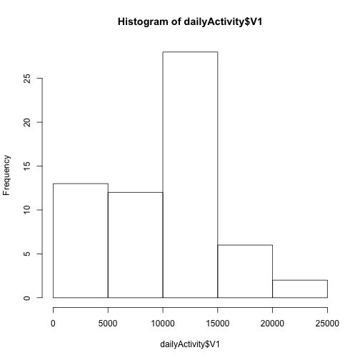
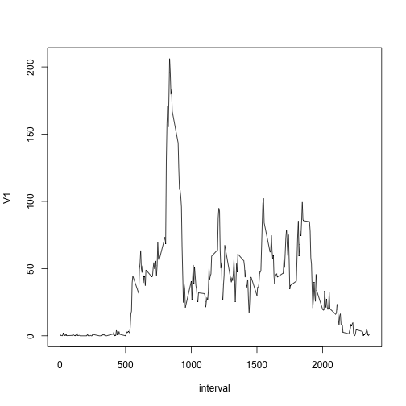

Reproducible Research: Peer Assessment 1
=========================================

Vlad Korolev


This document describes the analysis of daily activity given in the data file activity.csv.  The analysis includes mean total number of steps taken per day, average daily activity pattern, and difference between weekday and weekend activity patterns.  The code in this document depends on the  *knitr* and *plyr* packages.

You have to install *knitr* package manually via R-Studio pacakge interface.  The code below will install and activate the *plyr* package for you.


```r
r <- getOption("repos")  # hard code the US repo for CRAN
r["CRAN"] <- "http://cran.us.r-project.org"
options(repos = r)
rm(r)
install.packages("plyr")
```

```
## Installing package(s) into '/Users/vlad/Library/R/2.15/library'
## (as 'lib' is unspecified)
```

```
## 
## The downloaded binary packages are in
## 	/var/folders/3q/9_nx1kw10_b4hpy_hzn24wp8fx5_qm/T//RtmplaqI0J/downloaded_packages
```

```r
library(plyr)
```


## Loading and preprocessing the data

First we need to load the data into R.  Make sure that the current R directory is set to the directory where this file is located.


```r
activity <- read.csv("activity.csv")
```


The activity summary is:


```r

str(activity)
```

```
## 'data.frame':	17568 obs. of  3 variables:
##  $ steps   : int  NA NA NA NA NA NA NA NA NA NA ...
##  $ date    : Factor w/ 61 levels "2012-10-01","2012-10-02",..: 1 1 1 1 1 1 1 1 1 1 ...
##  $ interval: int  0 5 10 15 20 25 30 35 40 45 ...
```

```r
summary(activity)
```

```
##      steps               date          interval   
##  Min.   :  0.0   2012-10-01:  288   Min.   :   0  
##  1st Qu.:  0.0   2012-10-02:  288   1st Qu.: 589  
##  Median :  0.0   2012-10-03:  288   Median :1178  
##  Mean   : 37.4   2012-10-04:  288   Mean   :1178  
##  3rd Qu.: 12.0   2012-10-05:  288   3rd Qu.:1766  
##  Max.   :806.0   2012-10-06:  288   Max.   :2355  
##  NA's   :2304    (Other)   :15840
```


## What is mean total number of steps taken per day?

To answer this question first we need to reprocess our data.  We use the plyr package function ddply to combine all measurements taken within same day into a single data point.  We will do this by applying the sum function to all values within the same day.


```r
dailyActivity <- ddply(activity, c("date"), function(df) sum(df$steps, na.rm = TRUE))
```


The summary analysis of the daily activity is given below


```r
summary(dailyActivity$V1)
```

```
##    Min. 1st Qu.  Median    Mean 3rd Qu.    Max. 
##       0    6780   10400    9350   12800   21200
```


The historgram of the daily activity is produced by code below:


```r

hist(dailyActivity$V1)
```

 


## What is the average daily activity pattern?

Now to deal with this question we'd have to reshuffle our data again to summarize by the time interval.  This time instead of summation we will take the average (mean) of the actiity accross all days.


```r
intlActivity <- ddply(activity, c("interval"), function(df) mean(df$steps, na.rm = TRUE))
```


The plot of average activity for each interval is below


```r
plot(intlActivity, type = "l")
```

 


To find the maximum interval we will use the *which.max* function that will give us the index of the maximum row in the dataset.  Having this index we will get the corresponding interval value from the dataset.  This operation is performed by the code below:


```r
maxRow <- which.max(intlActivity$V1)
intlActivity$interval[maxRow]
```

```
## [1] 835
```


To validate the value let's use the max function


```r
intlActivity$V1[maxRow]
```

```
## [1] 206.2
```

```r
max(intlActivity$V1)
```

```
## [1] 206.2
```


Since the values above are equal, and they do not contradict the time series plot. We know we got a correct result.


## Imputing missing values

Unfortunately we have some missing values in our dataset.   The code below shows that we have 2304 missing measurements of steps


```r
summary(activity)
```

```
##      steps               date          interval   
##  Min.   :  0.0   2012-10-01:  288   Min.   :   0  
##  1st Qu.:  0.0   2012-10-02:  288   1st Qu.: 589  
##  Median :  0.0   2012-10-03:  288   Median :1178  
##  Mean   : 37.4   2012-10-04:  288   Mean   :1178  
##  3rd Qu.: 12.0   2012-10-05:  288   3rd Qu.:1766  
##  Max.   :806.0   2012-10-06:  288   Max.   :2355  
##  NA's   :2304    (Other)   :15840
```


## Are there differences in activity patterns between weekdays and weekends?
